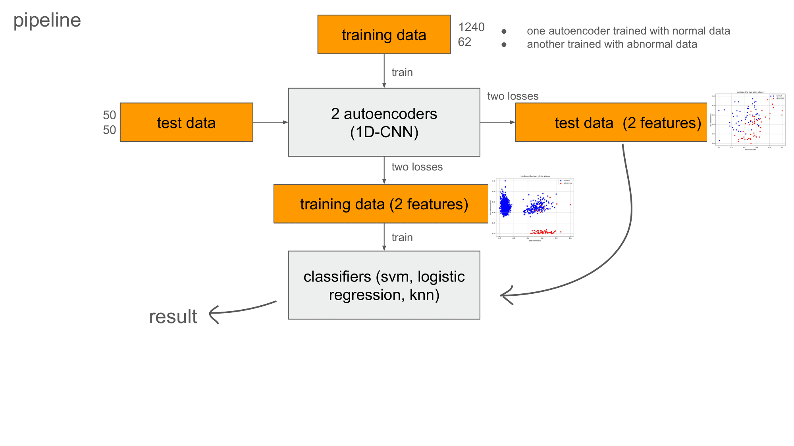
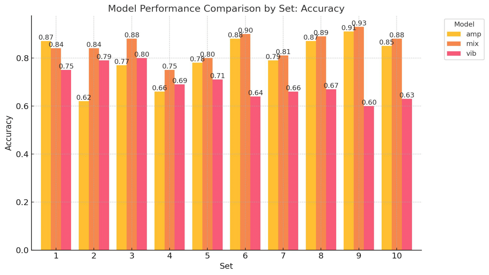

# 電梯再平層異常檢測專案
109700046 侯均頲
## 專案概述

* **目標**：偵測「再平層」事件（電梯到站第一次對齊後，因誤差過大而進行第二次對齊），以降低人工巡檢負擔。

* **資料**：馬達電流（channel 0）+ 六軸振動（門上 XYZ：channels 1–3；車廂/馬達背面 XYZ：channels 4–6），原始取樣率 8192 Hz，訓練前下採樣至約 256 Hz；實驗使用 0604–0605 的正常資料與 0607 的異常資料；切片聚焦 **Stage 3–5**。

* **方法**：各自以正常資料、異常資料訓練兩個 **1D-CNN Autoencoder**；每筆樣本輸入後得到兩個 reconstruction loss（視作 2D 特徵），再用 SVM / Logistic Regression / kNN 做最後分類。

* **通道發現**：門上 XYZ（1–3）較有訊號意義；車廂/馬達背面 XYZ（4–6）資訊性弱。電流（0）+ 門上振動（1,2,3）是最佳組合；包含 4–6 的組合準確率常掉到 ~0.7 或以下。

* **融合策略**：電流模型與振動模型的輸出做 **bitwise OR**，以小幅犧牲 precision 換取更高 recall（務實符合維運場景）。

* **評估**：採 **10 次完整管線重複實驗**（每次重新隨機劃分 train/test），彙整平均表現。

> 專案程式架構與設定（如 `config.py`）可在你的 repo 中查閱。

---

# 問題定義與資料描述

## 業務問題（再平層）

* **再平層定義**：電梯到達某一樓層後，控制系統會進行一次「平層」動作，將車廂位置與樓層對齊。但若 **第一次平層誤差過大**，電梯會再進行一次 **第二次平層**（即「再平層」）。
* **異常意義**：

  * 再平層雖然不是立即性的安全事故，但它往往是 **潛在問題的前兆**。
  * 根據公司內部的實務經驗，**再平層的出現與後續的多種異常狀況（例如馬達老化、煞車失效、控制系統校正異常、門機故障）呈高度正相關**。
  * 因此，**偵測再平層 ≈ 預警更多嚴重異常**。
* **目前困境**：

  * 公司原本依賴 **人工檢查**（維修人員聽聲音或查看記錄）來判斷是否出現再平層。
  * 人工檢查效率低、成本高，且受人員經驗影響。
* **專題目標**：

  * 開發一套 **基於感測訊號的自動化異常檢測方法**，讓系統能在早期就發現再平層，進而預防或降低後續異常風險，並大幅減少人工巡檢成本。

## 感測配置與通道

* **Channel 0**：馬達電流（amp）。
* **Channels 1–3**：門上振動 XYZ（你早期標注為 2–4，與投影片上的 1–3 為同一組，僅索引習慣不同）。
* **Channels 4–6**：車廂／馬達背面振動 XYZ（投影片稱 car xyz；你口述對應馬達背面）。

> 實驗發現：**門上 XYZ 資訊性高，車廂/馬達背面 XYZ 資訊性低**。

/report(easy)-10.png)

## 數據期間與採樣

* 正常資料：**0604–0605**；異常資料：**0607**。原始 **8192 Hz**，訓練前下採樣至 **\~256 Hz**。&#x20;
* 關注片段：**Stage 3–5**（對應行車階段中最能表徵再平層的訊段）。

## 資料切分與數量

* 投影片標示劃分為 **Train/Validate ＝ 85%/15%**，並列出數量：

  * 正常：train **1240**、valid **50**、test **50**
  * 異常：train **62**、valid **50**、test **50**
    （註：異常樣本稀少，故另留固定數量的驗證與測試，以保持評估公平。） &#x20;

---

# 方法設計（Architecture & Pipeline）

## 雙自編碼器（Dual-AE）設計

* 各自訓練兩個 **1D-CNN Autoencoder**：

  1. **Normal-AE**：只用正常資料訓練
  2. **Abnormal-AE**：只用異常資料訓練
* 推論時對每筆樣本分別計算 Normal-AE 與 Abnormal-AE 的 **reconstruction loss**；把兩個 loss 視作 **2D 特徵向量**（x=normal-loss, y=abnormal-loss），再餵入分類器（**SVM / Logistic Regression / kNN**）。 &#x20;

> repo 的 `config.py`（對齊了「**AE（非 VAE）**、**1D-CNN**、**不使用 FFT**」等預設；管線與已訓練分類器（如 `logreg_pipeline.joblib`、`knn_pipeline.joblib`）也都在倉庫中。

---

# 通道與模型訓練策略

## 單通道建模

1. **電流（Channel 0）**

   * 使用馬達電流單通道資料，訓練一對 Autoencoder。
   * **實驗結果**：

     * **Precision 較高（0.94）**，代表「判斷為異常時幾乎不會誤報」。
     * 但 Recall 偏低（0.62），異常檢出率不足。
   * 適合作為 **高精確度但較保守** 的檢測器。

2. **門上振動（Channels 1,2,3）**

   * 使用門上振動三軸資料，訓練另一對 Autoencoder。
   * **實驗結果**：

     * **Recall 較高（0.84）**，代表「異常檢出率較佳」。
     * Precision 相對較低（0.82），誤報機率增加。
   * 適合作為 **高靈敏度但較寬鬆** 的檢測器。

3. **電流 + 門上振動（0,1,2,3）**

   * 嘗試將電流與振動直接合併輸入，但結果並沒有比單獨訓練更好。
   * 原因推測為通道間訊號特性差異過大，導致 AE 難以同時兼顧。

---

## 後融合策略（OR）

* 由於單一模型各有優劣，採取 **OR 融合**：

  * **OR 規則**：`pred_final = pred_amp OR pred_vib`
  * 即若任一模型判斷為異常，則最終輸出異常。
* **優勢**：

  * Precision 稍微下降（0.82），但 Recall 大幅提升（0.92）。
  * F1-Score 提升至 0.87，是三者最佳。
  * 符合實務需求（寧可多報，不能漏報）。

---

# 實驗與結果
## 結果數據表

| 模型          | Accuracy | Precision | Recall   | F1-Score |
| ----------- | -------- | --------- | -------- | -------- |
| Amp (電流0)   | 0.79     | **0.94**  | 0.62     | 0.75     |
| Vib (1,2,3) | 0.83     | 0.82      | **0.84** | 0.83     |
| Mix (OR)    | **0.86** | 0.82      | **0.92** | **0.87** |

* **結論**：電流（0）側重 Precision，門上振動（1,2,3）側重 Recall，兩者互補。透過 OR 融合，整體 F1 最佳，Recall 亦達到實務所需的水準。

---

## 單路結果（每路均為 Dual-AE → 2D loss → 分類器）

* **電流（0）**：完成 train/test 評估（投影片給出混淆矩陣式標示 0/1）。
* **門上振動（1,2,3）**：同上，完成 train/test 評估。

## 通道組合與表現

* **最佳**：`[vibration 1,2,3] + [amp 0]`
* **次佳或不佳**：`[0,1,2,3]`、`[2,3]`、`[0,2,3]` 等常 **≤ \~0.7 accuracy**（以相同的 train/test 集下測得）。
* **洞見**：再次驗證 **4–6** 的資訊性偏弱；若強行加入，反而稀釋辨識訊息。

## 交叉驗證

* **完整管線重複 10 次**，每次重新隨機劃分 Train/Test 後再做訓練與測試，最後彙整 **平均結果** 作為報告數字。

---

# 設計抉擇與理由

1. **為何 AE 而非 VAE**

   * 目標是「重建誤差」本身；VAE 的機率建模與潛空間正則化在此非必要，AE 訓練更簡潔、較易穩定，且簡單測試之下確實沒有比較好。
2. **為何 1D-CNN（不做 FFT）**

   * 再平層屬時域瞬時事件；1D-CNN 能直接學到局部時域形狀與跨通道關聯。頻域特徵未必優於學得的時域特徵，且 FFT 會引入額外窗口化選擇與相位處理成本，且簡單測試之下確實沒有比較好。
3. **雙 AE + 2D loss 的好處**

   * 相對「單一 AE + 閾值」，「Normal-AE vs Abnormal-AE」兩維 loss (如同二維平面) 讓邊界更清楚也更直觀（如：正常樣本在 Normal-AE 上 loss 低、在 Abnormal-AE 上 loss 高，反之亦然），線性或核化分類器即可取得乾淨決策邊界。

---

# 侷限與風險

* **異常樣本偏少**（train 只有 62），泛化需小心；建議以 **分層 K-fold** 或 **時間分層** 的方式補強估計不確定性，或以 **重抽樣／類別權重** 平衡分類器。
* **資料期間單一**：僅使用 0604–0607；需在長週期、跨多台電梯上做 **時變漂移（concept drift）** 評估與更新策略。
* **尚未落地**：流程未串上即時資料流與告警回饋迴路，須補上部屬與維運面。

---

# 可落地化的下一步（Roadmap）

1. **評估指標調校**：

   * 明確追蹤 **Recall / Precision / F1 / AUROC** 與 **告警頻率**；以 ROC/PR-Curve 在不同閾值與分類器設定下找 sweet spot。
2. **模型管理**：

   * 每台電梯一組模型 vs 全域模型 + 微調；加上 **週／月回訓** 與 **資料漂移監測**（如 PSI、KS）。
3. **跨通道早期融合**（選配）：

   * 嘗試在 encoder 端做多通道卷積與注意力（仍保留後端 OR 作保險），觀察是否能在不吞噬 recall 的情況下提升 precision。

